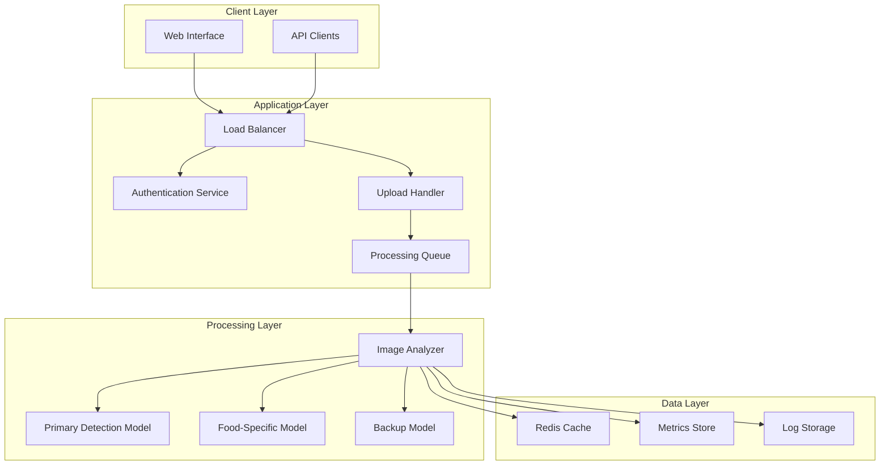

# Design Document: AI Image Detection Service

## Overview

The AI Image Detection Service is a web-based platform that analyzes images to determine whether they are AI-generated or authentic. The service addresses the growing problem of fraudulent refund claims in food delivery platforms, where customers submit fake AI-generated images of damaged or incorrect food items.

The system employs multiple detection algorithms and specialized models trained on food imagery to achieve high accuracy. It provides both a web interface for direct testing and a REST API for automated integration into existing refund processing systems.

## Architecture

The system follows a microservices architecture with clear separation of concerns:



### Key Architectural Decisions

1. **Stateless Processing**: Images are processed in memory without permanent storage to ensure privacy
2. **Queue-Based Processing**: Asynchronous processing handles high volume and provides scalability
3. **Multiple Model Ensemble**: Combines multiple detection algorithms for improved accuracy
4. **Caching Layer**: Redis cache stores temporary results and rate limiting data
5. **Microservices Design**: Separate services for authentication, upload handling, and analysis

## Components and Interfaces

### Web Interface Component

**Purpose**: Provides browser-based access for direct image testing

**Key Features**:
- Drag-and-drop image upload with preview
- Real-time progress indicators during analysis
- Results display with confidence scores and visual feedback
- Session-based analysis history
- Responsive design for mobile and desktop

**Interface Specifications**:
- Upload endpoint: `POST /web/upload`
- Results endpoint: `GET /web/results/{session_id}`
- History endpoint: `GET /web/history/{session_id}`

### REST API Component

**Purpose**: Enables programmatic integration for automated processing

**Core Endpoints**:

```
POST /api/v1/analyze
Content-Type: multipart/form-data
Authorization: Bearer {token}

Request Body:
- image: Binary image file
- metadata: Optional JSON with context information
Response:
{
  "analysis_id": "uuid",
  "classification": "AI-Generated|Authentic|Uncertain",
  "confidence_score": 85.7,
  "processing_time_ms": 1250,
  "model_versions": ["primary_v2.1", "food_v1.3"],
  "timestamp": "2024-01-15T10:30:00Z"
}
```

```
GET /api/v1/status/{analysis_id}
Authorization: Bearer {token}

Response:
{
  "status": "completed|processing|failed",
  "result": { /* analysis result if completed */ },
  "estimated_completion": "2024-01-15T10:30:15Z"
}
```

### Image Analyzer Component

**Purpose**: Core processing engine that coordinates multiple detection models

**Detection Pipeline**:
1. **Image Preprocessing**: Resize, normalize, and extract metadata
2. **Primary Analysis**: Run through ensemble of detection models
3. **Food-Specific Analysis**: Apply specialized food imagery models
4. **Confidence Calculation**: Aggregate results and compute final confidence score
5. **Result Classification**: Determine final classification based on thresholds

**Model Integration**:
- **Primary Model**: General-purpose AI detection using frequency domain analysis
- **Food Model**: Specialized model trained on food imagery patterns
- **Backup Model**: Fallback model for high availability
- **Ensemble Logic**: Weighted voting system combining all model outputs

### Authentication Service

**Purpose**: Manages API access control and rate limiting

**Features**:
- JWT-based token authentication
- Rate limiting per client (configurable limits)
- Usage tracking and quota management
- API key management for enterprise clients

### Processing Queue

**Purpose**: Manages asynchronous image processing workflow

**Implementation**:
- Redis-based message queue
- Priority queuing for different client tiers
- Automatic retry logic for failed analyses
- Dead letter queue for problematic images

### Model Learning and Updates

**Purpose**: Continuously improve detection accuracy while maintaining privacy

**Privacy-Preserving Learning Approach**:
- **Individual Image Privacy**: Customer images are processed in memory only and immediately deleted
- **Aggregate Pattern Learning**: Models learn from anonymized statistical patterns and metadata
- **Federated Learning**: Model updates can be shared across instances without sharing raw data
- **Separate Training Pipeline**: Model improvements use consented training datasets, not customer images
- **Feature Extraction**: Only anonymized feature vectors (not images) may be retained for pattern analysis

**Model Update Mechanisms**:
- **Version Control**: Models are versioned and can be updated without service interruption
- **A/B Testing**: New model versions can be tested against baseline performance
- **Rollback Capability**: Ability to revert to previous model versions if performance degrades
- **External Training**: Models are trained on external datasets and deployed as updates

## Privacy-Preserving Model Learning

The system maintains a strict separation between operational privacy and model improvement:

### Customer Data Privacy
- **Zero Retention**: Individual customer images are never stored permanently
- **Memory-Only Processing**: Images exist only in RAM during analysis (typically 1-30 seconds)
- **Immediate Cleanup**: Image data is wiped from memory immediately after analysis
- **No Training Use**: Customer images are never used for model training or improvement

### Model Improvement Methods
- **External Training Datasets**: Models are trained on publicly available or consented datasets
- **Aggregate Statistics**: Only anonymized statistical patterns (not images) may be collected
- **Feature Vectors**: Mathematical representations of patterns (not visual data) can be analyzed
- **Federated Learning**: Model improvements can be shared between instances without data sharing

### Example Learning Process
1. **Pattern Detection**: System identifies new AI generation signatures in aggregate
2. **External Research**: New patterns are researched using public datasets
3. **Model Training**: Updated models are trained on external, consented data
4. **Deployment**: New model versions are deployed via standard update mechanisms
5. **Validation**: Performance is validated without accessing customer data

This approach ensures that the service can evolve and improve its detection capabilities while maintaining absolute privacy for customer images submitted for fraud detection.

### Analysis Request

```typescript
interface AnalysisRequest {
  id: string;
  client_id: string;
  image_data: Buffer;
  image_metadata: {
    filename: string;
    size_bytes: number;
    format: string;
    dimensions: {
      width: number;
      height: number;
    };
  };
  processing_options: {
    priority: 'low' | 'normal' | 'high';
    models: string[];
    confidence_threshold: number;
  };
  timestamp: Date;
}
```

### Analysis Result

```typescript
interface AnalysisResult {
  analysis_id: string;
  classification: 'AI-Generated' | 'Authentic' | 'Uncertain';
  confidence_score: number; // 0-100
  model_results: {
    model_name: string;
    version: string;
    classification: string;
    confidence: number;
    processing_time_ms: number;
  }[];
  aggregated_features: {
    frequency_anomalies: number;
    texture_inconsistencies: number;
    compression_artifacts: number;
    generation_signatures: string[];
  };
  processing_metadata: {
    total_time_ms: number;
    queue_time_ms: number;
    models_used: string[];
    fallback_triggered: boolean;
  };
  timestamp: Date;
}
```

### Client Configuration

```typescript
interface ClientConfig {
  client_id: string;
  api_key_hash: string;
  rate_limits: {
    requests_per_minute: number;
    requests_per_day: number;
    concurrent_requests: number;
  };
  model_preferences: {
    primary_model: string;
    food_model_enabled: boolean;
    confidence_threshold: number;
  };
  webhook_config?: {
    url: string;
    events: string[];
    secret: string;
  };
}
```

### Usage Metrics

```typescript
interface UsageMetrics {
  client_id: string;
  date: Date;
  total_requests: number;
  successful_analyses: number;
  failed_analyses: number;
  classification_breakdown: {
    ai_generated: number;
    authentic: number;
    uncertain: number;
  };
  average_confidence: number;
  average_processing_time_ms: number;
  model_usage: {
    [model_name: string]: number;
  };
}
```

## Correctness Properties

*A property is a characteristic or behavior that should hold true across all valid executions of a system—essentially, a formal statement about what the system should do. Properties serve as the bridge between human-readable specifications and machine-verifiable correctness guarantees.*

Before defining the correctness properties, I need to analyze the acceptance criteria from the requirements document to determine which ones can be tested as properties.

### Property 1: Analysis Response Completeness
*For any* valid image submitted for analysis, the response should contain a classification (one of "AI-Generated", "Authentic", or "Uncertain"), a confidence score between 0-100%, and be returned within 30 seconds.
**Validates: Requirements 1.1, 1.2, 1.3, 3.2**

### Property 2: Image Format Support
*For any* image in JPEG, PNG, WebP, or TIFF format, the Detection_Service should successfully process it and return a valid analysis result.
**Validates: Requirements 1.5**

### Property 3: Error Handling Consistency
*For any* invalid input (corrupted files, unsupported formats, malformed requests), the Detection_Service should return appropriate error messages with descriptive failure reasons and proper HTTP status codes.
**Validates: Requirements 1.4, 8.1, 8.3**

### Property 4: Authentication and Security
*For any* API request, if authentication is required, the service should validate tokens before processing, use HTTPS/TLS for all communications, and reject requests with invalid credentials.
**Validates: Requirements 3.3, 6.3, 6.4**

### Property 5: Rate Limiting Enforcement
*For any* client exceeding configured rate limits, the Detection_Service should return HTTP 429 status with retry-after headers and queue subsequent requests appropriately.
**Validates: Requirements 3.4, 5.2**

### Property 6: Model Selection and Usage
*For any* image analysis, the Detection_Service should utilize multiple detection algorithms, apply food-specific models when analyzing food imagery, and include evidence of multiple model usage in results.
**Validates: Requirements 4.1, 4.2, 4.5**

### Property 7: Classification Threshold Logic
*For any* analysis result with confidence score below 70%, the Detection_Service should classify the result as "Uncertain".
**Validates: Requirements 4.3**

### Property 8: Concurrent Processing Capacity
*For any* set of up to 100 concurrent image analysis requests, the Detection_Service should process all requests successfully and return results for each.
**Validates: Requirements 5.1, 2.3**

### Property 9: Large Image Handling
*For any* image larger than 10MB, the Detection_Service should automatically resize it while preserving the ability to perform accurate analysis.
**Validates: Requirements 5.3**

### Property 10: Privacy and Memory Management
*For any* uploaded image, the Detection_Service should process it in memory without permanent storage and immediately delete image data from memory after analysis completion.
**Validates: Requirements 6.1, 6.2**

### Property 15: Model Learning Without Privacy Violation
*For any* model update process, the Detection_Service should improve detection capabilities using only anonymized aggregate patterns and external training data, never storing or using individual customer images for training.
**Validates: Requirements 4.4**

### Property 11: Logging Privacy
*For any* system event logged, the log entries should not contain image content or customer data while still providing sufficient debugging information.
**Validates: Requirements 6.5**

### Property 12: Metrics Collection and Reporting
*For any* analysis performed, the Detection_Service should track volume metrics per client, maintain result distribution statistics, and generate accurate reports without storing individual image data.
**Validates: Requirements 7.1, 7.2, 7.4**

### Property 13: Failover and Retry Logic
*For any* primary model failure or system overload condition, the Detection_Service should attempt analysis with backup models and automatically retry failed analyses.
**Validates: Requirements 8.2, 5.5**

### Property 14: Health Monitoring
*For any* system operation, the Detection_Service should collect health metrics including response times and error rates, and send automated alerts when critical errors occur.
**Validates: Requirements 8.4, 8.5**

## Error Handling

The system implements comprehensive error handling across all components:

### Input Validation Errors
- **Invalid Image Format**: Return HTTP 400 with supported format list
- **File Size Exceeded**: Return HTTP 413 with size limits
- **Corrupted Image Data**: Return HTTP 422 with validation details
- **Missing Required Fields**: Return HTTP 400 with field requirements

### Processing Errors
- **Model Failure**: Automatically failover to backup models
- **Timeout Errors**: Return HTTP 408 with retry recommendations
- **Memory Exhaustion**: Queue request for later processing
- **Analysis Uncertainty**: Return "Uncertain" classification with low confidence

### Authentication Errors
- **Invalid Token**: Return HTTP 401 with authentication requirements
- **Expired Token**: Return HTTP 401 with refresh instructions
- **Rate Limit Exceeded**: Return HTTP 429 with retry-after headers
- **Insufficient Permissions**: Return HTTP 403 with required permissions

### System Errors
- **Service Unavailable**: Return HTTP 503 with estimated recovery time
- **Database Connection**: Graceful degradation with cached responses
- **Queue Overflow**: Return HTTP 503 with backpressure indication
- **Critical System Failure**: Automated alerts and failover procedures

### Error Response Format
```json
{
  "error": {
    "code": "INVALID_IMAGE_FORMAT",
    "message": "Unsupported image format. Supported formats: JPEG, PNG, WebP, TIFF",
    "details": {
      "received_format": "BMP",
      "supported_formats": ["JPEG", "PNG", "WebP", "TIFF"]
    },
    "timestamp": "2024-01-15T10:30:00Z",
    "request_id": "req_123456789"
  }
}
```

## Testing Strategy

The testing strategy employs a dual approach combining unit tests for specific scenarios and property-based tests for comprehensive coverage:

### Property-Based Testing
- **Framework**: Use Hypothesis (Python) or fast-check (TypeScript) for property-based testing
- **Test Configuration**: Minimum 100 iterations per property test to ensure statistical confidence
- **Image Generation**: Generate diverse test images including various formats, sizes, and content types
- **Model Testing**: Test detection models with both AI-generated and authentic images
- **API Testing**: Generate random valid and invalid API requests to test all endpoints
- **Concurrency Testing**: Generate concurrent request loads to test scalability properties

### Unit Testing
- **Specific Examples**: Test known AI-generated images and authentic images
- **Edge Cases**: Test boundary conditions like exactly 10MB files, 70% confidence thresholds
- **Integration Points**: Test API endpoint responses, authentication flows, error conditions
- **Mock Testing**: Mock external dependencies like AI models for isolated component testing

### Test Organization
Each property-based test must reference its corresponding design property:
- **Tag Format**: `Feature: ai-image-detection-service, Property {number}: {property_text}`
- **Example**: `Feature: ai-image-detection-service, Property 1: Analysis Response Completeness`

### Performance Testing
- **Load Testing**: Verify 100+ concurrent request handling
- **Stress Testing**: Test system behavior under extreme load conditions
- **Memory Testing**: Verify image data cleanup and memory usage patterns
- **Response Time Testing**: Ensure 30-second analysis time limits are met

### Security Testing
- **Authentication Testing**: Test token validation and security mechanisms
- **Privacy Testing**: Verify no permanent image storage and proper data cleanup
- **Transport Security**: Verify HTTPS/TLS encryption for all communications
- **Input Sanitization**: Test with malicious or malformed image data

The combination of property-based and unit testing ensures both comprehensive coverage across all possible inputs and validation of specific critical scenarios. Property tests catch edge cases and verify universal correctness, while unit tests validate concrete examples and integration points.